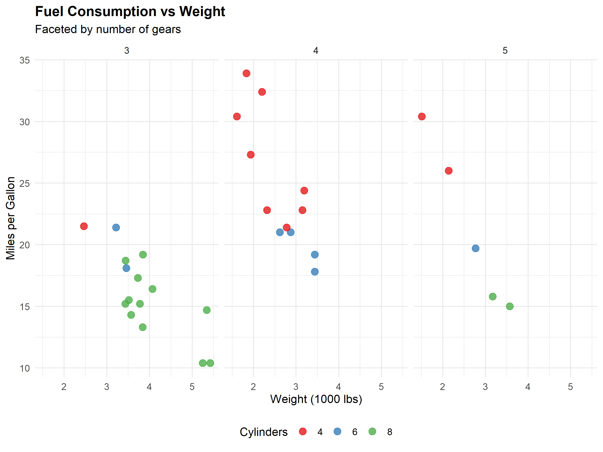

```r
library(ggplot2)

# Load data
data(mtcars)

# Convert variables to factors
mtcars$cyl <- factor(mtcars$cyl)
mtcars$gear <- factor(mtcars$gear)

# Create Plot
p <- ggplot(mtcars, aes(x = wt, y = mpg, color = cyl)) +
  geom_point(size = 3, alpha = 0.8) +
  facet_wrap(~gear) +
  scale_color_brewer(palette = "Set1") +
  labs(
    title = "Fuel Consumption vs Weight",
    subtitle = "Faceted by number of gears",
    x = "Weight (1000 lbs)",
    y = "Miles per Gallon",
    color = "Cylinders"
  ) +
  theme_minimal()

# Show plot
print(p)
```
### Visualisation des résultats

